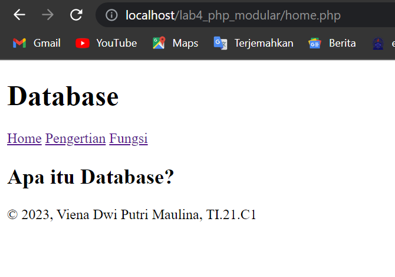
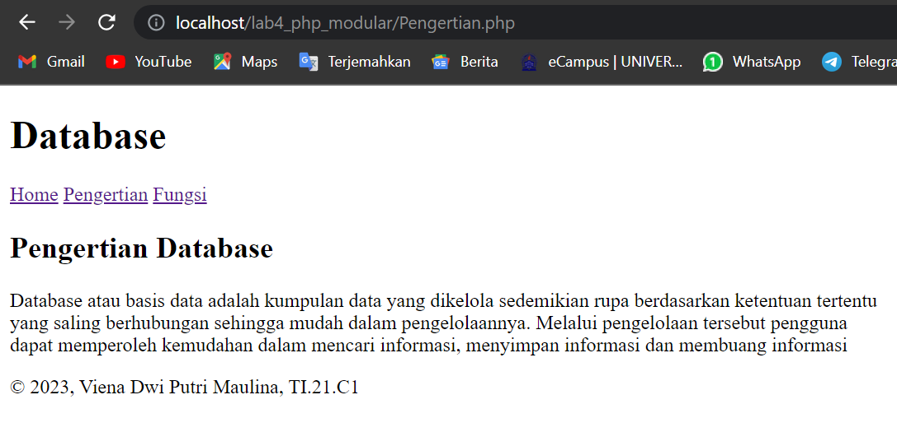
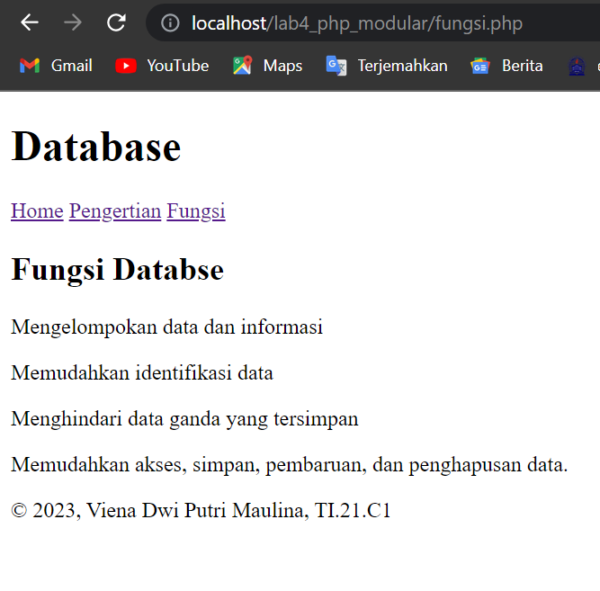

# Lab4Web
<p> Nama : Viena Dwi Putri Maulina <br> Nim : 312110469 <br> Kelas  : TI.21.C1 <br> Mata Kuliah : Pemrograman Web 2 <br> Tugas Pertemuan 5 </p>

<p> Buat folder baru dengan nama lab4_php_modular pada docroot webserver (htdocs) </p>

<h4> Header </h4>
<p> header.php <p>

```php
<!DOCTYPE html>
<html lang="en">
<head>
    <meta charset="UTF-8">
    <title> Database</title>
    <link href="style.css" rel="stylesheet" type="text/stylesheet" media="screen"/>
</head>
<body>
    <div class="container">
        <header>
            <h1> Database </h1>
        </header>
        <nav>
            <a href="home.php">Home</a>
            <a href="Pengertian.php">Pengertian</a>
            <a href="fungsi.php">Fungsi</a>
        </nav>
```

<h4> Footer </h4>
<p> header.php <p>

```php
        <footer>
            <p>&copy; 2023, Viena Dwi Putri Maulina, TI.21.C1 </p>
        </footer>
    </div>
</body>
</html>
```

<h4> Home </h4>
<p> home.php </p>

```php
<?php require('header.php'); ?>
<div class="content">
    <h2>Apa itu Database?</h2>
</div>
<?php require('footer.php'); ?>
```

<h4> Pengertian </h4>
<p> Pengertian.php <p>

```php
<?php require('header.php'); ?>
<div class="content">
    <h2>Pengertian Database</h2>
    <p>Database atau basis data adalah kumpulan data yang dikelola sedemikian rupa berdasarkan 
        ketentuan tertentu <br>yang saling berhubungan sehingga mudah dalam pengelolaannya. Melalui 
        pengelolaan tersebut pengguna<br> dapat memperoleh kemudahan dalam mencari informasi, menyimpan 
        informasi dan membuang informasi</p>
</div>
<?php require('footer.php'); ?>
```

<h4> Fungsi </h4>
<p> fungsi.php </p>

```php
<?php require('header.php'); ?>
<div class="content">
    <h2>Fungsi Databse</h2>
    <p>Mengelompokan data dan informasi</p> 
    <p>Memudahkan identifikasi data</p>
    <p>Menghindari data ganda yang tersimpan</p> 
    <p>Memudahkan akses, simpan, pembaruan, dan penghapusan data.</p>
</div>
<?php require('footer.php'); ?>
```

<h4> Index </h4>
<p> index.php </php>

 ```php
 <?php
$mod = $_REQUEST['mod'];

switch ($mod){
    case "home":
        require("home.php");
        break;
    case "Pengertian":
        require("Pengertian.php");
        break;
    case "fungsi":
        require("fungsi.php");
        break;
    default :
        require("home.php");

}
?>
```

<h4> Output <h4>
 <p> buka link http://localhost/lab4_php_modular/home.php <br> maka hasilnya seperti berikut</p>
 
 
 
 <p> klik pengertian <br> maka hasilnya seperti berikut </p>
 
 
 
 <p> klik fungsi <br> maka hasilnya seperti berikut </p>
 
 
